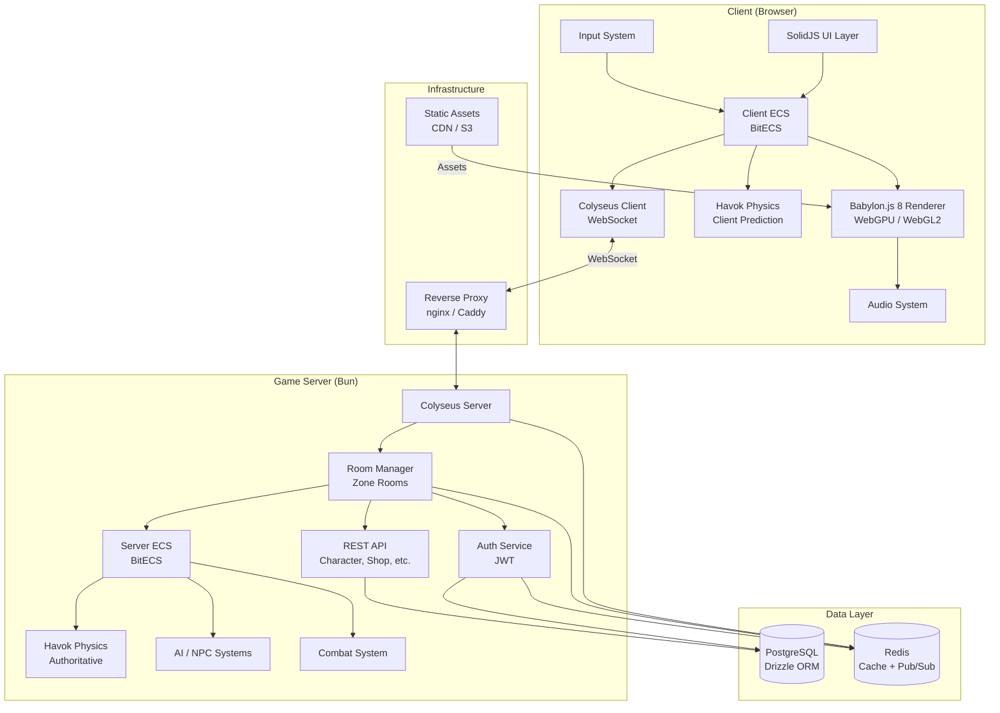
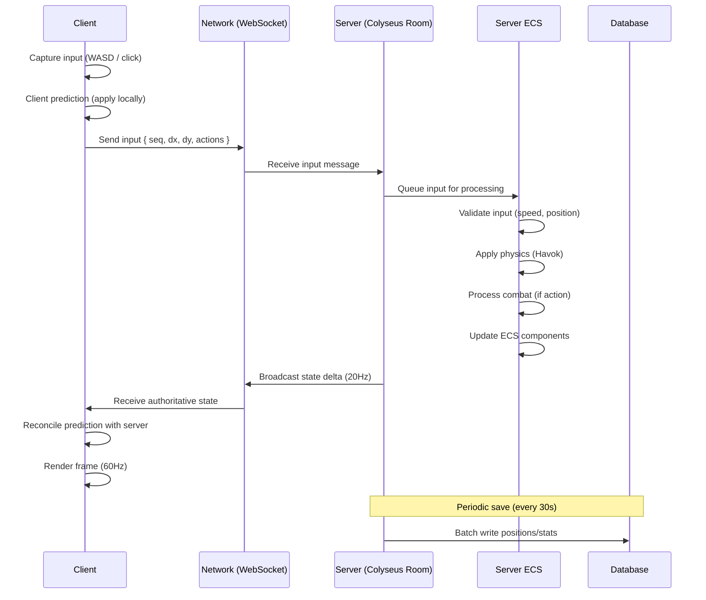
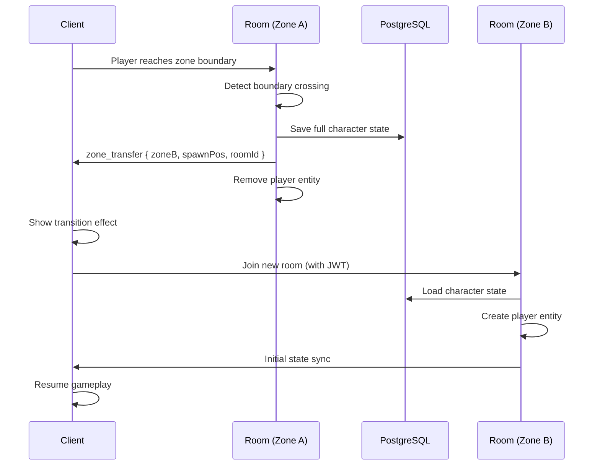
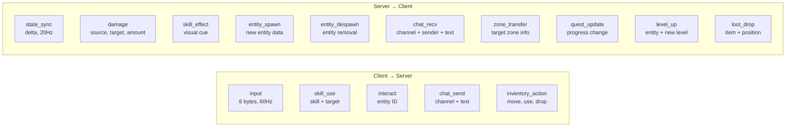
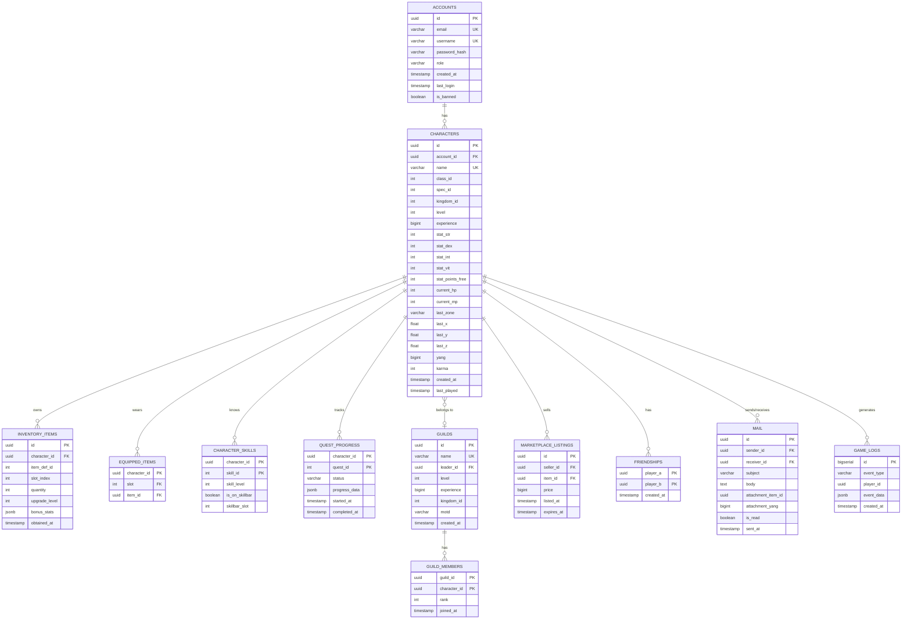
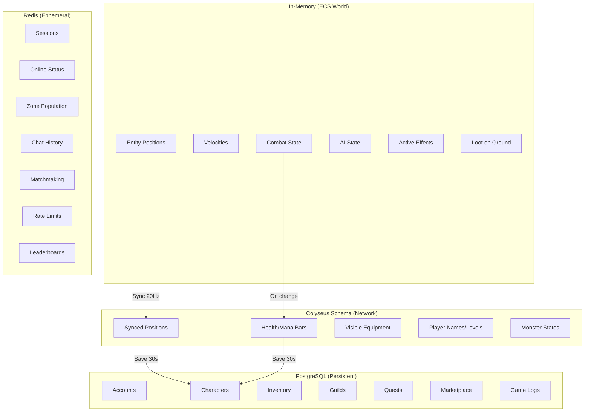

# Massless — Technical Architecture Document

> **Version:** 1.0
> **Date:** 2026-02-17
> **Status:** Living document

---

## 1. System Overview

Massless is a browser-based MMORPG built on an isomorphic TypeScript stack. The architecture is designed for server-authoritative gameplay, horizontal scalability, and zero-download browser access.

### System Diagram



## 2. Data Flow

### Player Input → World State Update



### Zone Transfer Flow



## 3. Component Map (ECS)

### Shared Components (packages/shared)

All ECS components are defined in the shared package and used by both client and server.

```mermaid
graph LR
    subgraph "Core Components"
        T[Transform<br/>x, y, z, rotY]
        V[Velocity<br/>vx, vy, vz]
        NI[NetworkIdentity<br/>netId, ownerId]
    end

    subgraph "Character Components"
        H[Health<br/>current, max, regen]
        M[Mana<br/>current, max, regen]
        CS[CharacterStats<br/>str, dex, int, vit]
        CL[CharacterLevel<br/>level, xp, xpToNext]
        CC[CharacterClass<br/>classId, specId]
        KD[Kingdom<br/>kingdomId]
    end

    subgraph "Combat Components"
        CB[CombatStats<br/>atk, def, critCh, critMul, atkSpd]
        TG[Target<br/>entityId, distance]
        AA[AutoAttack<br/>lastTime, interval, active]
        SK[SkillCooldowns<br/>cooldownEnd[20]]
        SE[StatusEffects<br/>flags, endTimes[16]]
    end

    subgraph "World Components"
        MN[Monster<br/>typeId, spawnX, spawnZ, aggroRange, leashRange]
        AI_C[AIState<br/>state, targetEid, pathIndex]
        NPC[NPCData<br/>npcId, dialogueId]
        LT[Loot<br/>itemId, quantity, ownerPlayerId, despawnTime]
        MS[MetinStone<br/>typeId, hp, maxHp, level]
    end

    subgraph "Client-Only Components"
        MR[MeshRef<br/>meshInstanceId]
        AN[Animation<br/>currentAnim, blendWeight]
        PFX[ParticleRef<br/>effectId]
        NM[Nameplate<br/>displayName]
    end

    subgraph "Server-Only Components"
        PD[Persistence<br/>characterId, lastSave]
        RL[RateLimit<br/>lastInput, inputCount]
        CONN[Connection<br/>clientSessionId]
    end
```

### ECS System Execution Order

#### Server (20Hz tick)

```
1. InputSystem         — Process queued player inputs
2. AISystem            — Update monster behavior states
3. PathfindingSystem   — Calculate AI movement paths
4. MovementSystem      — Apply velocities, validate positions
5. PhysicsSystem       — Havok step (collision detection)
6. CombatSystem        — Process attacks, calculate damage
7. SkillSystem         — Execute skill effects
8. StatusEffectSystem  — Tick buffs/debuffs, remove expired
9. HealthRegenSystem   — Regenerate HP/MP
10. DeathSystem        — Handle entity death, loot drops
11. SpawnSystem        — Respawn monsters on timers
12. LootSystem         — Manage loot despawn timers
13. PersistenceSystem  — Periodic save to PostgreSQL
14. NetworkSyncSystem  — Sync ECS state to Colyseus Schema
```

#### Client (60Hz frame)

```
1. InputCaptureSystem  — Read keyboard/mouse state
2. PredictionSystem    — Apply local input prediction
3. NetworkRecvSystem   — Apply server state updates, reconcile
4. InterpolationSystem — Interpolate remote entity positions
5. AnimationSystem     — Update animation states and blending
6. MeshSyncSystem      — Sync ECS Transform to Babylon.js meshes
7. ParticleSystem      — Update particle effects
8. CameraSystem        — Update camera follow/collision
9. UIUpdateSystem      — Push data to SolidJS signals (throttled 10Hz)
10. AudioSystem        — Trigger positional audio
```

## 4. Network Protocol

See [ADR-004: Networking Protocol](./ADR-004-networking-protocol.md) for detailed message definitions.

### Message Types Overview



## 5. Database Schema

### Entity Relationship Diagram



### Key Indexes

```sql
-- Performance-critical queries
CREATE INDEX idx_characters_account ON characters(account_id);
CREATE INDEX idx_characters_name ON characters(name);
CREATE INDEX idx_characters_kingdom ON characters(kingdom_id);
CREATE INDEX idx_inventory_character ON inventory_items(character_id);
CREATE INDEX idx_inventory_slot ON inventory_items(character_id, slot_index);
CREATE INDEX idx_marketplace_price ON marketplace_listings(item_def_id, price);
CREATE INDEX idx_marketplace_seller ON marketplace_listings(seller_id);
CREATE INDEX idx_marketplace_expires ON marketplace_listings(expires_at);
CREATE INDEX idx_game_logs_player ON game_logs(player_id, created_at);
CREATE INDEX idx_game_logs_type ON game_logs(event_type, created_at);
CREATE INDEX idx_mail_receiver ON mail(receiver_id, is_read);
```

## 6. State Management

### What Lives Where



## 7. Scaling Strategy

### Phase 1: Single Server (0-500 CCU)

```
[Browser] ←→ [nginx] ←→ [Bun Server (Colyseus + API)]
                              ↓           ↓
                         [PostgreSQL]  [Redis]
```

- Single Bun process handles all Colyseus rooms
- Each zone = one Colyseus room
- PostgreSQL and Redis on same machine or docker network
- Target: 500 CCU with 20Hz tick rate

### Phase 2: Horizontal Scaling (500-5000 CCU)

```
[Browser] ←→ [Load Balancer]
                   ↓
         ┌────────┼────────┐
    [Server 1] [Server 2] [Server 3]
    (Zones 1-3) (Zones 4-6) (Zones 7-9)
         └────────┼────────┘
              [Redis Cluster]
                   ↓
            [PostgreSQL Primary]
              ↓          ↓
         [Read Replica] [Read Replica]
```

- Multiple Bun server instances, each managing a subset of zones
- Redis Pub/Sub for cross-server communication (chat, zone transfer)
- Colyseus Redis driver for room discovery across servers
- PostgreSQL read replicas for non-critical queries (leaderboards, marketplace)

### Phase 3: Full Scale (5000+ CCU)

```
[CDN] → [Browser] ←→ [Load Balancer (sticky sessions)]
                            ↓
                   [Kubernetes Cluster]
                   ┌────────────────┐
                   │ Game Server Pods│
                   │ (auto-scaling)  │
                   └────────┬───────┘
                            ↓
              ┌─────────────┼─────────────┐
         [Redis Sentinel]  [PostgreSQL]  [Monitoring]
         [3-node cluster]  [HA setup]    [Prometheus]
```

- Kubernetes with horizontal pod autoscaling
- Sticky sessions for WebSocket connections
- Redis Sentinel for high availability
- PostgreSQL with automated failover
- Prometheus + Grafana for monitoring

## 8. Security Model

### Anti-Cheat Architecture

```
Client sends ONLY:
  ✅ Movement intents (direction + speed flag)
  ✅ Action intents (attack target X, use skill Y)
  ✅ UI interactions (open shop, select quest)

Client NEVER sends:
  ❌ Absolute positions
  ❌ Damage values
  ❌ Item creation/duplication
  ❌ Stat modifications
  ❌ Other player's state changes
```

### Validation Layers

| Layer | What it Validates |
|-------|-------------------|
| **Input rate** | Max 60 inputs/s per client |
| **Movement speed** | Position change ≤ max_speed × delta_time |
| **Combat range** | Target within weapon/skill range |
| **Cooldowns** | Skill not on cooldown |
| **Resources** | Sufficient mana/HP for action |
| **Inventory** | Item exists in player's inventory for use/trade |
| **Economy** | Sufficient Yang for purchase, valid trade amounts |
| **Position** | Player on walkable terrain, not inside walls |

### Rate Limiting (Redis-backed)

| Action | Limit |
|--------|-------|
| Login attempts | 5/min per IP |
| API requests | 100/min per account |
| Chat messages | Channel-specific (see ADR-009) |
| Trade requests | 10/min per player |
| Skill usage | Enforced by cooldowns |
| Item actions | 30/min per player |

### Data Sanitization

- All chat messages: Strip HTML, limit length, filter profanity
- All string inputs: Validate encoding, max length, no null bytes
- All numeric inputs: Range validation, NaN/Infinity checks
- All entity IDs: Verify entity exists and is accessible to player

---

## Architecture Decision Records

| ADR | Title | Status |
|-----|-------|--------|
| [ADR-001](./ADR-001-camera-system.md) | Camera System | Accepted |
| [ADR-002](./ADR-002-terrain-system.md) | Terrain System | Accepted |
| [ADR-003](./ADR-003-combat-architecture.md) | Combat Architecture | Accepted |
| [ADR-004](./ADR-004-networking-protocol.md) | Networking Protocol | Accepted |
| [ADR-005](./ADR-005-persistence-strategy.md) | Persistence Strategy | Accepted |
| [ADR-006](./ADR-006-authentication.md) | Authentication & Sessions | Accepted |
| [ADR-007](./ADR-007-pathfinding.md) | Pathfinding System | Accepted |
| [ADR-008](./ADR-008-asset-pipeline.md) | Asset Pipeline | Accepted |
| [ADR-009](./ADR-009-chat-system.md) | Chat System | Accepted |
