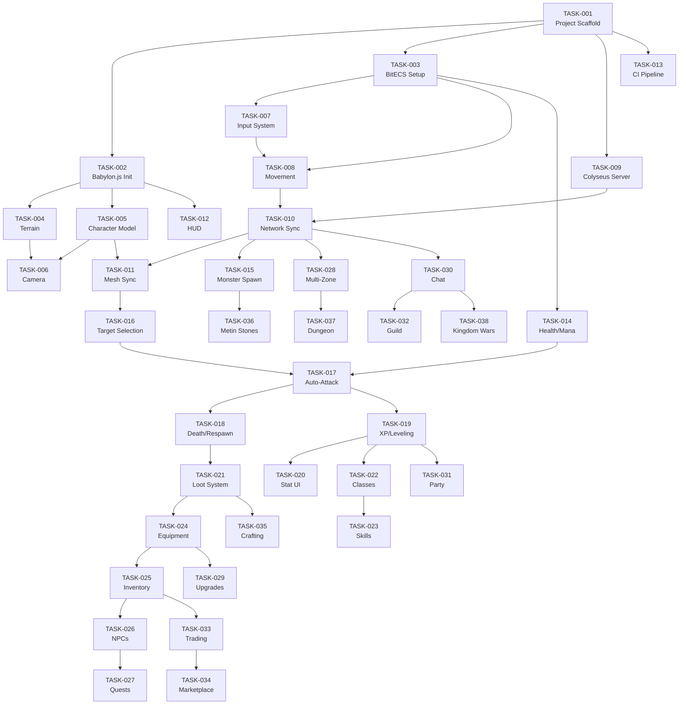

# Massless — Development Roadmap

> **Version:** 1.0
> **Date:** 2026-02-17

---

## Milestone Overview

| Milestone | Name | Goal |
|-----------|------|------|
| **M1** | Walking Skeleton | Connect, see world, move, see other players |
| **M2** | First Blood | Fight monsters and other players |
| **M3** | The Adventurer | RPG systems: classes, skills, equipment, quests |
| **M4** | Community | Social features: chat, guilds, trading, kingdom wars |
| **M5** | Endgame | Dungeons, bosses, ranked PvP, item upgrading, mounts |

---

## Milestone 1: "Walking Skeleton" (Foundation)

**Goal:** A character can connect, see a 3D world, move around, and see other players moving in real-time.

### Tasks

#### TASK-001: Project Scaffold & Monorepo Setup
**Phase:** MVP | **Priority:** P0 | **Complexity:** L
**Dependencies:** None

##### Acceptance Criteria
- [ ] Bun workspace with `apps/client`, `apps/server`, `packages/shared`
- [ ] TypeScript strict mode configured across all packages
- [ ] Shared package importable from both client and server
- [ ] `bun run dev` starts both client and server with hot reload
- [ ] `bun run build` produces production builds
- [ ] Docker Compose for PostgreSQL and Redis
- [ ] ESLint + Prettier configured and enforced

##### Files to Create
- `package.json` (workspace root)
- `tsconfig.base.json`
- `apps/client/package.json`, `apps/client/tsconfig.json`
- `apps/server/package.json`, `apps/server/tsconfig.json`
- `packages/shared/package.json`, `packages/shared/tsconfig.json`
- `.eslintrc.json`, `.prettierrc`
- `docker-compose.yml`

---

#### TASK-002: Babylon.js Engine Initialization
**Phase:** MVP | **Priority:** P0 | **Complexity:** M
**Dependencies:** TASK-001

##### Acceptance Criteria
- [ ] Babylon.js 8 initialized with WebGPU (WebGL2 fallback)
- [ ] Canvas renders a basic scene (ground plane, skybox, directional light)
- [ ] FPS counter visible in dev mode
- [ ] Engine properly handles window resize
- [ ] WebGPU detection and fallback logic works

##### Files to Create
- `apps/client/src/engine/Engine.ts`
- `apps/client/src/engine/SceneManager.ts`
- `apps/client/src/main.ts`

---

#### TASK-003: BitECS World Setup
**Phase:** MVP | **Priority:** P0 | **Complexity:** M
**Dependencies:** TASK-001

##### Acceptance Criteria
- [ ] BitECS world created on both client and server
- [ ] Core components defined in shared package: Transform, Velocity, NetworkIdentity
- [ ] Entity creation and component assignment works
- [ ] Query system functional for filtering entities

##### Test Requirements
- [ ] Unit tests: component definition, entity creation, querying
- [ ] Verify TypedArray-backed components work correctly

##### Files to Create
- `packages/shared/src/ecs/world.ts`
- `packages/shared/src/ecs/components/core.ts`
- `packages/shared/src/ecs/components/core.test.ts`

---

#### TASK-004: Basic Terrain Rendering
**Phase:** MVP | **Priority:** P0 | **Complexity:** M
**Dependencies:** TASK-002

##### Acceptance Criteria
- [ ] Flat ground mesh rendered (128x128 units)
- [ ] Basic grass texture applied
- [ ] Ground receives shadows
- [ ] Environment: skybox + directional sun light

##### Files to Create
- `apps/client/src/terrain/TerrainManager.ts`
- `apps/client/src/terrain/TerrainChunk.ts`

---

#### TASK-005: Character Model Loading
**Phase:** MVP | **Priority:** P0 | **Complexity:** M
**Dependencies:** TASK-002

##### Acceptance Criteria
- [ ] Placeholder character model loaded (can use a simple capsule/box initially)
- [ ] Character positioned on terrain
- [ ] Character visible from camera
- [ ] Model supports basic idle animation (or rotation as placeholder)

##### Files to Create
- `apps/client/src/entities/CharacterRenderer.ts`
- `apps/client/src/assets/AssetLoader.ts`

---

#### TASK-006: Camera System
**Phase:** MVP | **Priority:** P0 | **Complexity:** M
**Dependencies:** TASK-004, TASK-005

##### Acceptance Criteria
- [ ] ArcRotateCamera following player character
- [ ] Right-click drag to rotate camera
- [ ] Scroll wheel to zoom in/out
- [ ] Camera min/max radius and elevation enforced
- [ ] Smooth camera follow (lerped)
- [ ] Camera collision with terrain (no clipping through ground)

##### Test Requirements
- [ ] Unit test: camera parameter clamping

##### Files to Create
- `apps/client/src/camera/GameCamera.ts`

---

#### TASK-007: Input System
**Phase:** MVP | **Priority:** P0 | **Complexity:** M
**Dependencies:** TASK-003

##### Acceptance Criteria
- [ ] WASD keyboard input captured
- [ ] Input state tracked as movement vector (dx, dy)
- [ ] Mouse click detected for targeting
- [ ] Input system runs as ECS system
- [ ] Input properly handles focus (no input when chat is focused)

##### Test Requirements
- [ ] Unit tests: input vector normalization, key state tracking

##### Files to Create
- `apps/client/src/ecs/systems/InputSystem.ts`
- `apps/client/src/input/InputManager.ts`

---

#### TASK-008: Movement System (Client-Side)
**Phase:** MVP | **Priority:** P0 | **Complexity:** M
**Dependencies:** TASK-003, TASK-007

##### Acceptance Criteria
- [ ] Character moves based on input vector
- [ ] Movement speed configurable (base: 5 units/second)
- [ ] Character faces movement direction
- [ ] Movement is frame-rate independent (delta time)
- [ ] Zero-allocation rule followed

##### Test Requirements
- [ ] Unit tests: movement calculation, direction facing, delta time independence

##### Files to Create
- `packages/shared/src/ecs/systems/MovementSystem.ts`
- `packages/shared/src/ecs/systems/MovementSystem.test.ts`

---

#### TASK-009: Colyseus Server Setup
**Phase:** MVP | **Priority:** P0 | **Complexity:** L
**Dependencies:** TASK-001

##### Acceptance Criteria
- [ ] Colyseus server running on Bun
- [ ] Basic ZoneRoom defined
- [ ] Room accepts WebSocket connections
- [ ] Room state includes player list with positions
- [ ] Health check endpoint responds

##### Test Requirements
- [ ] Integration test: room creation, client join/leave

##### Files to Create
- `apps/server/src/main.ts`
- `apps/server/src/rooms/ZoneRoom.ts`
- `apps/server/src/rooms/ZoneRoom.test.ts`

---

#### TASK-010: Network Sync (Client ↔ Server)
**Phase:** MVP | **Priority:** P0 | **Complexity:** XL
**Dependencies:** TASK-008, TASK-009

##### Acceptance Criteria
- [ ] Client connects to Colyseus room on game start
- [ ] Client sends input messages to server at tick rate
- [ ] Server processes inputs and updates positions authoritatively
- [ ] Server broadcasts state to all clients at 20Hz
- [ ] Client receives state updates and applies to ECS
- [ ] Remote players visible and moving smoothly (interpolation)
- [ ] Client prediction for local player (no input lag)
- [ ] Server reconciliation (correct mispredictions)

##### Test Requirements
- [ ] Unit tests: input serialization, state deserialization
- [ ] Integration tests: client join → input → state sync round-trip
- [ ] Test with 2+ simulated clients

##### Files to Create
- `apps/client/src/network/NetworkManager.ts`
- `apps/client/src/ecs/systems/NetworkSendSystem.ts`
- `apps/client/src/ecs/systems/NetworkRecvSystem.ts`
- `apps/client/src/ecs/systems/InterpolationSystem.ts`
- `apps/server/src/ecs/systems/InputProcessingSystem.ts`
- `apps/server/src/ecs/systems/NetworkSyncSystem.ts`
- `packages/shared/src/network/messages.ts`

---

#### TASK-011: Mesh Sync System
**Phase:** MVP | **Priority:** P0 | **Complexity:** M
**Dependencies:** TASK-005, TASK-010

##### Acceptance Criteria
- [ ] ECS Transform components synced to Babylon.js mesh positions
- [ ] New entities get meshes created automatically
- [ ] Removed entities get meshes disposed
- [ ] Position updates are smooth (lerped for remote entities)

##### Files to Create
- `apps/client/src/ecs/systems/MeshSyncSystem.ts`

---

#### TASK-012: Basic HUD
**Phase:** MVP | **Priority:** P1 | **Complexity:** M
**Dependencies:** TASK-002

##### Acceptance Criteria
- [ ] SolidJS renders HUD overlay on top of canvas
- [ ] FPS counter (dev mode)
- [ ] Player coordinates (dev mode)
- [ ] Player count in zone
- [ ] Health bar placeholder
- [ ] Minimap placeholder (basic rectangle)

##### Files to Create
- `apps/client/src/ui/HUD.tsx`
- `apps/client/src/ui/HealthBar.tsx`
- `apps/client/src/ui/Minimap.tsx`
- `apps/client/src/ui/DevOverlay.tsx`

---

#### TASK-013: CI Pipeline
**Phase:** MVP | **Priority:** P1 | **Complexity:** M
**Dependencies:** TASK-001

##### Acceptance Criteria
- [ ] GitHub Actions workflow triggers on push/PR
- [ ] Runs ESLint + TypeScript type-check
- [ ] Runs Vitest unit tests
- [ ] Runs build check (client + server)
- [ ] Reports test coverage
- [ ] Fails PR if any check fails

##### Files to Create
- `.github/workflows/ci.yml`

---

### Milestone 1 Definition of Done
- [ ] All TASK-001 through TASK-013 completed
- [ ] Player can open browser, see 3D world, move with WASD
- [ ] Second player in another browser tab sees first player moving
- [ ] CI pipeline running on all PRs
- [ ] 60fps on mid-range hardware
- [ ] No TypeScript or lint errors
- [ ] Architecture docs current

---

## Milestone 2: "First Blood" (Combat MVP)

**Goal:** Players can fight monsters and each other.

### Tasks

#### TASK-014: Health & Mana Components
**Phase:** MVP | **Priority:** P0 | **Complexity:** S
**Dependencies:** TASK-003

- [ ] Health component: current, max, regenRate
- [ ] Mana component: current, max, regenRate
- [ ] HealthRegenSystem (server-side, 1Hz)
- [ ] Health/Mana synced to clients

#### TASK-015: Monster Spawning System
**Phase:** MVP | **Priority:** P0 | **Complexity:** L
**Dependencies:** TASK-003, TASK-010

- [ ] Monster type definitions (shared package)
- [ ] SpawnSystem: create monsters at defined positions
- [ ] Monsters visible to clients with placeholder meshes
- [ ] Monsters have Health components
- [ ] Respawn after death on timer

#### TASK-016: Target Selection
**Phase:** MVP | **Priority:** P0 | **Complexity:** M
**Dependencies:** TASK-011

- [ ] Left-click on entity sets as target
- [ ] Target component tracks selected entity
- [ ] Visual indicator (ring) under targeted entity
- [ ] Tab key cycles nearby hostile entities
- [ ] Deselect when clicking empty space

#### TASK-017: Auto-Attack System
**Phase:** MVP | **Priority:** P0 | **Complexity:** L
**Dependencies:** TASK-016, TASK-014

- [ ] Auto-attack starts when target is in range
- [ ] Server validates range and calculates damage
- [ ] Damage applied to target's Health
- [ ] Attack speed based on weapon/stats
- [ ] Hit animations/effects on client
- [ ] Floating damage numbers

#### TASK-018: Death & Respawn
**Phase:** MVP | **Priority:** P0 | **Complexity:** M
**Dependencies:** TASK-017

- [ ] Entity dies when HP reaches 0
- [ ] Death animation/effect
- [ ] Players respawn at town after 5 seconds
- [ ] Death penalty: lose 5% current XP
- [ ] Monsters drop loot on death (basic)
- [ ] Monster respawn on timer

#### TASK-019: Experience & Leveling
**Phase:** MVP | **Priority:** P0 | **Complexity:** M
**Dependencies:** TASK-017

- [ ] XP awarded on monster kill (XP curve formula)
- [ ] Level-up when XP threshold reached
- [ ] Stat points awarded on level-up (3 per level)
- [ ] Level-up visual/audio effect
- [ ] Stats affect combat (STR → damage, VIT → HP)

#### TASK-020: Stat Allocation UI
**Phase:** MVP | **Priority:** P1 | **Complexity:** M
**Dependencies:** TASK-019

- [ ] Character sheet panel showing stats
- [ ] Allocate free stat points
- [ ] Stats recalculate combat values
- [ ] Display derived stats (ATK, DEF, HP, MP)

#### TASK-021: Basic Loot System
**Phase:** MVP | **Priority:** P1 | **Complexity:** M
**Dependencies:** TASK-018

- [ ] Monsters drop items on death (loot table)
- [ ] Loot appears on ground with visual indicator
- [ ] Click to pick up (if close enough)
- [ ] Item goes to inventory
- [ ] Loot despawns after 60 seconds

### Milestone 2 Definition of Done
- [ ] Players can attack and kill monsters
- [ ] Players can attack each other
- [ ] Monsters respawn after being killed
- [ ] XP gained from kills, level-up works
- [ ] Basic loot drops and pickup
- [ ] Stat allocation functional

---

## Milestone 3: "The Adventurer" (RPG Systems)

**Goal:** It starts feeling like an RPG with classes, skills, equipment, and quests.

### Tasks

#### TASK-022: Character Class System
- [ ] 4 classes: Warrior, Assassin, Shaman, Sorcerer
- [ ] Class selection at character creation
- [ ] Class affects base stats and available skills
- [ ] Class-specific starting equipment

#### TASK-023: Skill System
- [ ] Skill definitions in shared package
- [ ] Skill learning (NPC trainer or level-based)
- [ ] Skill bar (10 slots)
- [ ] Skill execution pipeline (cooldown → resource → range → effect)
- [ ] 3-5 skills per class for initial release
- [ ] Skill upgrade with skill points

#### TASK-024: Equipment System
- [ ] Equipment slots: weapon, helmet, armor, boots, accessory × 2
- [ ] Equipment stats modify combat values
- [ ] Equipment visually changes character model (future: placeholder colors)
- [ ] Class restrictions on equipment
- [ ] Item rarity tiers: Common, Uncommon, Rare

#### TASK-025: Inventory System
- [ ] Grid-based inventory (45 slots)
- [ ] Drag-and-drop item movement
- [ ] Stack identical items
- [ ] Item tooltips with stats
- [ ] Use consumables from inventory
- [ ] Drop items from inventory

#### TASK-026: NPC System
- [ ] NPC entities with dialogue
- [ ] Shop NPCs (buy/sell)
- [ ] Quest NPCs
- [ ] NPC interaction (click to open dialogue)
- [ ] NPC shops with item listings and prices

#### TASK-027: Quest System (Basic)
- [ ] Quest definitions (JSON/config)
- [ ] Quest types: kill, collect, talk
- [ ] Quest tracking in UI
- [ ] Quest rewards (XP, Yang, items)
- [ ] 10 starter quests for first zone

#### TASK-028: Multiple Zones
- [ ] 3 zones: starter town, field area, second area
- [ ] Zone boundaries with transition triggers
- [ ] Zone transfer via Colyseus room switching
- [ ] Each zone has own monster spawns and NPCs
- [ ] Loading screen during zone transfer

#### TASK-029: Equipment Upgrade System
- [ ] NPC blacksmith for upgrades
- [ ] +1 to +9 upgrade levels
- [ ] Success rates per level (decreasing)
- [ ] Failure consequences (downgrade, destroy at +9)
- [ ] Upgrade materials consumed
- [ ] Visual feedback: success/failure animation

### Milestone 3 Definition of Done
- [ ] 4 playable classes with unique skills
- [ ] Full equipment system with upgrades
- [ ] Inventory management
- [ ] NPCs with shops and quests
- [ ] Multiple zones with transitions
- [ ] 10+ quests available

---

## Milestone 4: "Community" (Social & Economy)

**Goal:** Players interact meaningfully through chat, guilds, and trade.

### Tasks

#### TASK-030: Chat System
- [ ] Local, zone, kingdom, global channels
- [ ] Whisper (private messages)
- [ ] Chat UI with tabs
- [ ] Profanity filter
- [ ] Rate limiting

#### TASK-031: Party System
- [ ] Invite/accept/leave party
- [ ] Party chat channel
- [ ] Shared XP in party (distance-based)
- [ ] Party health bars on HUD
- [ ] Party member positions on minimap

#### TASK-032: Guild System
- [ ] Create guild (name, leader)
- [ ] Invite/kick members
- [ ] Guild ranks with permissions
- [ ] Guild chat channel
- [ ] Guild info panel

#### TASK-033: Player Trading
- [ ] Trade window between two players
- [ ] Add items and Yang to trade offer
- [ ] Both players confirm
- [ ] Atomic transaction (both inventories update)
- [ ] Trade logging

#### TASK-034: Marketplace
- [ ] List items for sale (with price)
- [ ] Browse/search listings
- [ ] Buy items
- [ ] Listing fee (5% Yang sink)
- [ ] Expired listing return

#### TASK-035: Crafting (Basic)
- [ ] Recipe system
- [ ] Gather materials from monsters
- [ ] Craft at NPC workstation
- [ ] 10-20 basic recipes

#### TASK-036: Metin Stones
- [ ] Metin Stone world objects (spawn on timer)
- [ ] Attack to destroy (group content)
- [ ] Buff nearby monsters while active
- [ ] Drop loot to participants
- [ ] Zone-wide announcement on spawn/destroy

#### TASK-037: First Dungeon
- [ ] Instanced 3-player dungeon
- [ ] Multiple rooms with monster groups
- [ ] Boss fight with basic mechanics
- [ ] Loot from boss
- [ ] Dungeon entrance in world

#### TASK-038: Kingdom Wars (Basic)
- [ ] Scheduled war events (e.g., weekends)
- [ ] PvP zone activates during war
- [ ] Kill tracking per kingdom
- [ ] Winner announcement
- [ ] Rewards for participants

### Milestone 4 Definition of Done
- [ ] Full chat system operational
- [ ] Guilds functional
- [ ] Player trading and marketplace
- [ ] First dungeon completable
- [ ] Kingdom wars events running

---

## Milestone 5: "Endgame" (Advanced Content)

### Tasks (High-Level)

#### TASK-039: Dungeon System (Full)
- Multiple dungeons with varied mechanics
- Boss encounters with phases
- Dungeon-specific loot tables

#### TASK-040: Ranked PvP Arena
- 1v1 and 3v3 matchmaking
- Seasonal rankings
- PvP-specific rewards

#### TASK-041: Guild Wars
- Guild vs guild combat
- Territory claiming
- Guild rewards/progression

#### TASK-042: Mount System
- Mount acquisition (quest/purchase)
- Mounted movement (faster)
- Mounted combat

#### TASK-043: Pet System
- Companion pets
- Pet abilities (loot pickup, stat bonus)
- Pet leveling

#### TASK-044: Achievement System
- Achievement definitions
- Progress tracking
- Title/cosmetic rewards

#### TASK-045: Extended Item Enhancement
- +10 to +15 upgrade levels
- Special materials required
- Legendary item crafting

#### TASK-046: Seasonal Events
- Time-limited content
- Holiday themes
- Exclusive rewards

---

## Dependency Graph

